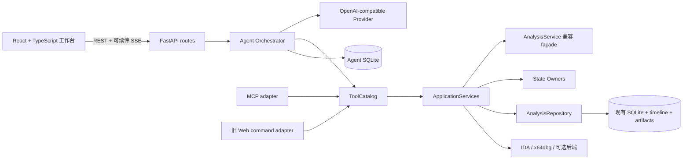
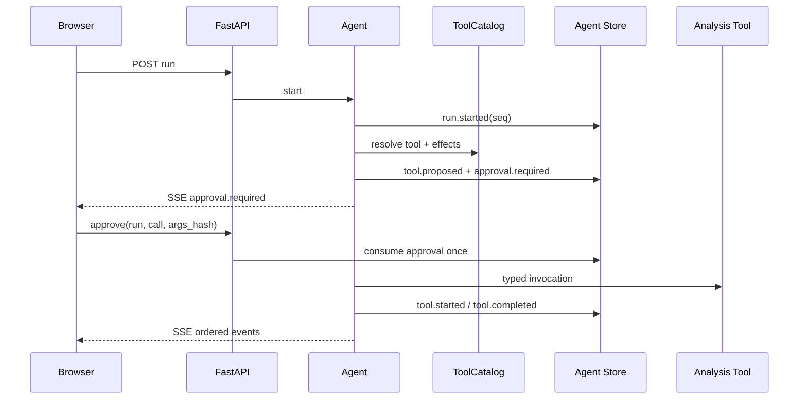

# Headless RE-MCP 统一架构与浏览器 WebUI Agent 工作台交接

> 工作目录：`E:\x64dbgmcp`  
> 基线提交：`b9050c6ddbc1d556a396ee2330093f7c1bec6a3e`  
> 分支：`main`，相对 `origin/main` ahead 2  
> 基线采集时间（工作区时钟）：`2026-07-28T19:57:32.8833494+08:00`  
> 状态：架构迁移进行中；浏览器 WebUI Agent 工作台尚未实现  
> 权威性：本文合并并取代“架构改造后续检查点”和“浏览器 WebUI Agent 工作台”两份独立执行计划

本文是给下一位开发者的可执行交接基线，不是完成报告。历史 `ROADMAP_TODO.md`、旧会话交接文档和原始 Cursor plan 只用于追溯；后续任务状态、依赖顺序和完成定义以本文为准。

## 0. 执行与汇报约定

- 后续执行者应连续完成本文全部待办检查点，再统一汇报结果；不要按检查点向用户分批汇报。
- 检查点仍用于内部依赖控制、回归定位和验收，不表示允许交付半成品。
- 如果出现真实阻塞、需求冲突、不可逆操作或工作区改动冲突，应立即停止并请求决策。
- 不得回退、覆盖或格式化掉当前脏工作区中来源不明的改动；必须在现有改动之上继续。
- 不创建提交、不推送、不 amend，除非用户另行明确要求。

---

## 1. 合并后的单一目标

在不破坏现有 MCP、Web、CLI、零窗口分析和 `Result` envelope 兼容性的前提下，完成两层改造：

1. **内层架构收敛**：正交化运行状态，建立 repository 边界和协议无关工具目录，拆分巨型传输入口，使 `AnalysisService` 只保留兼容 façade 职责。
2. **外层产品升级**：将现有 FastAPI 单页监控台升级为 React 浏览器工作台；在服务端增加多 provider、可恢复 Agent、逐次工具审批、REST/SSE 和独立持久化，并让 MCP、旧 Web 与 Agent 复用同一个工具目录。

最终形态：



关键约束是：**工具定义只能有一个来源，状态只能有一个 owner，持久化只能穿过显式 repository，传输层不复制业务规则。**

---

## 2. 当前真实基线

### 2.1 已接受完成的前置项

| 检查点 | 状态 | 当前证据 |
| --- | --- | --- |
| 静态服务组合 | 已完成 | `AnalysisService` 采用静态 mixin 组合；源码内未发现运行时 `setattr`/`MethodType` 方法注入 |
| 应用服务边界 | 已完成（兼容迁移态） | `core/application_services.py` 已定义 runtime、dynamic、interaction、artifact 服务；`AnalysisService.services` 已装配 |

“已完成”表示对应迁移目标已建立，不表示 `AnalysisService` 已经足够小。当前 façade 仍有 5831 行，应用服务中部分方法仍回调 façade；这是后续收敛的兼容起点，不应反向恢复运行时注入。

### 2.2 已部分落地、仍需闭环的项

| 检查点 | 状态 | 已有实现 | 缺口 |
| --- | --- | --- | --- |
| 正交状态 | 进行中 | `BackendRuntimeOwner`、`DebuggeeStateOwner`、`WorkflowStateOwner`、`UnpackStateOwner`、`TraceStateOwner` 已存在并装配 | 兼容字典仍广泛可见；跨域转换和锁作用域尚未通过专门测试证明完全统一 |
| Repository 边界 | 部分完成 | `AnalysisRepository`、`SqliteAnalysisRepository` 已存在；默认 service 已注入 repository | 旧 `_store` 兼容访问和分散持久化调用仍需收敛；缺少 repository contract/transaction 专项回归 |
| 共享命令目录 | 部分完成 | `CommandSpec`、`CommandCatalog`、MCP adapter、Web adapter 已存在 | 目录只显式覆盖少量核心命令；其余工具通过动态默认项注册，无完整 effects/Agent transport 分类 |
| MCP 入口拆分 | 部分完成 | `mcp/registry.py` 已迁出 session、static、detect、workflow、.NET 部分工具 | `mcp/server.py` 仍有 1585 行和约 127 个装饰器注册；当前 `server.tool` 替换逻辑只能作为迁移桥接 |
| Web 入口拆分 | 未完成 | `web/commands.py` 已抽出有限写命令 adapter | `web/app.py` 仍有 623 行；路由、认证依赖和应用装配尚未分域 |

### 2.3 尚未开始的 WebUI/Agent 项

当前仓库不存在以下目录：

```text
src/headless_re_mcp/tools/
src/headless_re_mcp/agent/
webui/
```

因此以下能力均不得描述为已实现：

- 多 provider 配置与 OpenAI-compatible 流式客户端；
- Zerofall 安全配置导入；
- Agent 状态机、上下文压缩、工具循环和独立 SQLite；
- Agent REST、逐次审批和可续传 SSE；
- React/Vite 三栏工作台；
- 前端测试、构建和 FastAPI 生产托管。

### 2.4 本次交接未执行的动作

- 未继续修改架构或实现 WebUI/Agent。
- 未运行新的 pytest、Ruff、Mypy、compileall 或浏览器 Gate。
- 未提交、未推送、未清理工作区。
- 本文中的测试数字不得引用历史文档作为当前通过证据；接手者必须重新执行完整门禁。

---

## 3. 模块职责与依赖方向

### 3.1 核心与应用层

| 模块 | 唯一职责 | 禁止承担的职责 |
| --- | --- | --- |
| `core/runtime_state.py` | backend、debuggee、workflow、unpack、trace 的内存状态所有权和锁 | HTTP/MCP、SQLite、模型调用 |
| `core/repository.py` | 现有分析会话、backend、artifact、timeline、audit 的持久化 port | Agent 消息模型、传输 schema |
| `core/application_services.py` | 用例编排和显式依赖组合 | 路由注册、provider 协议 |
| `core/service.py` | 兼容 façade 和稳定公共方法 | 新增聊天、SSE、provider、前端职责 |
| `tools/` | 协议无关工具定义、typed handler、schema、effects、transport 策略 | FastMCP/FastAPI 生命周期和 Agent 状态 |

依赖只能从 transport/Agent 指向 `tools` 和 application ports，不能让核心层反向 import MCP、FastAPI 或 React 产物。

### 3.2 Agent 层

建议结构：

```text
src/headless_re_mcp/agent/
  models.py            # thread/message/run/tool-call/event 领域模型
  config.py            # provider profile 与安全配置存储
  redaction.py         # 配置、日志、审计统一脱敏
  context.py           # 有界上下文、工具结果摘要和压缩
  orchestrator.py      # 模型流、工具循环、审批与取消状态机
  store.py             # 独立 Agent SQLite repository
  providers/
    base.py            # Provider port
    openai_compatible.py
```

聊天职责不得进入 `core/service.py`。Agent 数据库与现有分析数据库逻辑独立，但 thread 可以保存关联的 analysis `session_id`。

### 3.3 传输层

建议结构：

```text
src/headless_re_mcp/mcp/
  adapter.py
  server.py            # 只做 composition root
  domains/*.py         # 如仍需传输适配，按域拆分

src/headless_re_mcp/web/
  app.py               # 只做 FastAPI composition root
  deps.py
  routes/
    agent.py
    providers.py
    sessions.py
    monitor.py
    artifacts.py
    setup.py
```

MCP 与 FastAPI 路由只负责鉴权、参数/协议适配和结果编码，不负责判断工具业务语义。

### 3.4 浏览器层

```text
webui/
  package.json
  package-lock.json
  vite.config.ts
  tsconfig*.json
  src/
    app/
    api/
    agent/
    sessions/
    monitor/
    artifacts/
    setup/
    components/
```

优先函数组件、hooks、reducer 和按领域组织的状态。不要把旧 `web/static/index.html` 的单文件逻辑原样搬入一个巨型 React 组件。

---

## 4. 正交状态模型

### 4.1 分离的状态轴

| 状态轴 | Owner | 示例状态 | 规则 |
| --- | --- | --- | --- |
| Session lifecycle | `SessionRegistry` | created/opening/ready/closing/closed/failed | 描述逻辑会话生命周期，不直接等于 debuggee 状态 |
| Backend runtime | `BackendRuntimeOwner` | absent/opening/ready/failed/closed | 以 `(session_id, BackendKind)` 隔离 |
| Debuggee | `DebuggeeStateOwner` | idle/running/paused/exited | 只有 `observe` 可以投影到兼容 session 视图 |
| Workflow | `WorkflowStateOwner` | active/terminal/failed/cancelled | backend 失败时保留结构化终态，不与 backend 字典共用所有权 |
| Unpack | `UnpackStateOwner` | detected/running/.../verified/failed/cancelled | timeline 和保护快照由同一 owner/repository 协调 |
| Trace | `TraceStateOwner` | inactive/recording/completed/failed | artifact 生命周期独立于 debuggee 状态 |

必须删除新代码对兼容字典的直接写入。兼容字段只能是 owner 管理数据的只读别名或受控代理。

### 4.2 Agent run 状态机

```text
queued
  -> streaming
  -> awaiting_approval
  -> executing_tool
  -> streaming
  -> completed

任意可运行状态 -> failed | cancelled
服务重启时未完成 run -> interrupted
审批拒绝 -> 生成 tool rejection message -> streaming 或 completed
```

状态转换必须持久化为单调 `seq` 的 `run_events`，以支持浏览器刷新和 `after=<seq>` 续传。

### 4.3 审批状态与绑定

审批记录绑定：

```text
run_id + tool_call_id + canonical_args_sha256
```

约束：

- 只允许消费一次；
- 参数变化后旧审批失效；
- 不提供“全局批准危险操作”；
- 拒绝结果作为 tool message 回传模型；
- 取消、超时或 run 终态后审批不可再消费。

---

## 5. 单一 ToolCatalog 契约

`CommandCatalog` 必须演进为协议无关的 `ToolCatalog`。每个工具定义至少包含：

```text
name
summary / description
typed handler
input schema
service/application mapping
effects: set[read_only | state_change | file_write]
transports: set[mcp | legacy_web | agent]
timeout/resource policy
```

规则：

1. JSON Schema 由同一 typed handler/Pydantic 约束生成；MCP 与 Agent 不得各自手写 schema。
2. 现有 MCP 工具名、参数、默认值、约束、描述和 `Result` envelope 保持兼容。
3. `read_only` 工具可由 Agent 自动执行。
4. 只要包含 `state_change` 或 `file_write`，每次调用都必须单独审批。
5. 进程启动/附加、运行控制、暂停/步进、寄存器/内存修改、断点/补丁、UI 操作、会话关闭、workflow 执行和 artifact 写入均不得误分为只读。
6. 未显式分类的工具默认禁止 Agent 使用；不得用当前动态默认 `CommandSpec` 绕过分类。
7. 保持调试器语义白名单，不增加任意 x64dbg、shell、PowerShell、CMD、Python 或 JavaScript 执行工具。
8. 旧 Web 写接口也从目录读取确认策略，不再维护独立动作表。

迁移完成后，`mcp/server.py` 不应通过替换 `server.tool` 来捕获目录元数据；应由 catalog-driven adapter 显式注册全部工具。

---

## 6. Provider、密钥与 Zerofall 兼容边界

### 6.1 Provider 首版范围

- 支持多个 endpoint/profile、当前模型、模型目录、thinking 开关、reasoning effort、上下文压缩阈值。
- 首版实现带流式 `tool_calls` 的 OpenAI-compatible `/v1/chat/completions`。
- 规范化 base URL，兼容调用方传入含 `/v1` 和不含 `/v1` 的地址。
- Provider 使用 port/interface，避免 orchestrator 绑定单一协议。
- 环境变量优先于文件；配置文件权限做本机最佳努力保护。

### 6.2 Zerofall 导入

只允许“预览 -> 用户确认 -> 应用”导入以下字段：

```text
ai.apiBaseUrl
apiKey
model
knownModels
modelCatalogs
providerApiKeys
enableThinking
reasoningEffort
contextCompressionThresholdPercent
```

禁止导入 `localHttpAccessToken` 和其他业务设置。预览、API 响应、日志、审计和异常均不得返回 key 的原值。

### 6.3 统一脱敏

脱敏器至少覆盖字段名和嵌套结构中的：

```text
api_key
authorization
token
secret
password
providerApiKeys
```

模型密钥只存在于 FastAPI 服务端，禁止进入浏览器状态、聊天消息、SSE、tool result、timeline 或 audit。

---

## 7. Agent 持久化与数据流

Agent SQLite 至少包含：

```text
threads
messages
runs
tool_calls
run_events
```

约束：

- thread 可关联现有 analysis `session_id`；不得复制 analysis runtime 状态。
- `run_events.seq` 在单 run 内严格单调。
- 超大工具结果保存有界摘要和现有 artifact 引用，禁止把 dump/反编译全文无限写入 SQLite。
- 增加最大工具轮数、单工具超时、总 run deadline、取消信号和并发保护。
- 服务重启后将未完成 run 标记为 `interrupted`，不能假装继续执行已失去上下文的工具。
- 工具输出、源码、日志、HTML、JSON 和分析 artifact 都是不可信数据；不得把其中内容提升为系统指令。
- 不向前端暴露模型隐藏推理，只流式传输用户可见文本、结构化工具事件和错误摘要。

一次危险工具调用的数据流：



---

## 8. FastAPI 与 SSE 契约

### 8.1 必须保留

- 只绑定 loopback；非 loopback 默认拒绝。
- 现有 bearer token 防护和旧监控 API。
- `start_web.py` 自动端口、打开系统浏览器和安装向导参数兼容。
- 现有监控、会话、事件、artifact、audit、安装向导和 MCP 配置导出能力。

### 8.2 新增 API 族

按职责拆到 `web/routes/agent.py`、`providers.py` 等模块，提供：

- thread 创建、列表、详情和消息历史；
- run 创建、查询和取消；
- tool call 批准/拒绝；
- provider profile 配置、模型探测；
- Zerofall 预览/确认导入；
- SSE run events。

创建 run 返回 `202 + run_id`，不得让 POST 长时间等待模型或审批。

### 8.3 SSE 事件

至少支持：

```text
run.started
message.delta
tool.proposed
approval.required
tool.started
tool.completed
run.completed
run.failed
run.cancelled
heartbeat
```

SSE 端点接受 `after=<seq>` 并按序回放。前端使用带 `Authorization` 的 fetch-stream；启动 URL 中的 Web token 完成引导后必须从地址栏移除。

---

## 9. React 工作台完成形态

### 9.1 信息架构

- 左侧：聊天 thread、analysis session 选择和历史。
- 中间：聊天主工作区、流式消息、tool event 和审批卡。
- 右侧：监控、工具调用、timeline、artifacts、audit、截图和 workflow/unpack 状态。
- 安装向导与 provider 设置作为明确入口保留。
- 窄屏降级为抽屉式侧栏。

建议组件：

```text
ChatWorkspace
ConversationSidebar
SessionSelector
ApprovalCard
InspectorTabs
MonitorPanel
TimelinePanel
ArtifactsPanel
AuditPanel
SetupWizard
ProviderSettings
```

### 9.2 UX 与安全

- 审批卡显示工具名、参数摘要、风险类型和预期影响。
- 只提供本次“批准/拒绝”。
- 深浅主题、紧凑工具事件卡和可折叠检查器可以借鉴 Zerofall，但不得复制其二进制、缓存、WebView2 或运行时资源。
- Provider key 不进入浏览器；任何配置响应只能表示“已配置/来源/掩码”，不能返回原值。

### 9.3 构建托管

- 开发：Vite 代理 `/api`。
- 发布：构建产物进入 Python 包内静态目录，由 FastAPI 托管。
- FastAPI 为 SPA 客户端路由提供 index fallback，但 `/api/*`、`/healthz` 和静态资源错误不得被错误改写为 index。
- 源码开发缺少前端构建时，`start_web.py` 给出明确构建命令；发布包直接使用已构建资源。

---

## 10. 合并后的检查点与依赖顺序

### P0：已完成前置基线

- [x] 删除 service 扩展运行时方法注入，使用静态可检查组合。
- [x] 提取 runtime、dynamic、interaction、artifact 应用服务，保留 `AnalysisService` 兼容 façade。

### P1：正交化运行状态

- [ ] 所有 backend/runtime 写入经 `BackendRuntimeOwner`。
- [ ] debuggee -> session 兼容投影只经 `DebuggeeStateOwner.observe`。
- [ ] workflow、unpack、trace 不直接借用 backend/session 状态。
- [ ] 明确各 owner 锁作用域和关闭/失败转换。
- [ ] 删除新代码对兼容字典的直接写入并补状态转换测试。

### P2：闭环 Repository 边界

- [ ] session、backend、artifact、timeline、audit、unpack snapshot 持久化全部经 `AnalysisRepository`。
- [ ] 应用服务不依赖 `SessionStore` 具体类型。
- [ ] 自定义 repository 不因 `_store` 兼容代码失败。
- [ ] 明确 transaction/原子性边界并增加 contract tests。
- [ ] 崩溃恢复和 unclean session 语义保持兼容。

### P3：统一全部 ToolCatalog

- [ ] 将全部 MCP typed handlers 按领域迁入 `tools/`。
- [ ] 每项具有显式 schema、effects、transport 和资源策略。
- [ ] 未分类项 Agent fail-closed。
- [ ] MCP、旧 Web、Agent 由同一目录绑定。
- [ ] 删除 `server.tool` 替换桥接和重复映射。
- [ ] 精确证明原 MCP 工具集合与输入 schema 不变。

### P4：拆分 MCP/Web 传输入口

- [ ] `mcp/server.py` 收敛为 composition root。
- [ ] `web/app.py` 收敛为 composition root。
- [ ] 认证、路由、SSE、静态托管和依赖装配职责分离。
- [ ] 保留旧 Web API、loopback/token 和 `start_web.py` 行为。

### P5：Provider 配置与脱敏

- [ ] 实现 provider port 和 OpenAI-compatible 流式客户端。
- [ ] 实现多 profile、URL 规范化、模型配置和服务端安全存储。
- [ ] 实现 Zerofall 预览/确认导入白名单。
- [ ] 配置、日志、审计、异常和事件统一脱敏。
- [ ] 在 Web extra 中加入实际使用的异步 HTTP 客户端，不猜测版本。

### P6：Agent runtime 与独立持久化

- [ ] 实现 thread/message/run/tool-call/event 模型和 SQLite repository。
- [ ] 实现可恢复 run 状态机、上下文裁剪/摘要和 artifact 引用。
- [ ] 实现只读自动执行、危险调用逐次审批、拒绝、取消和超时。
- [ ] 实现最大工具轮数、并发保护和服务重启 `interrupted`。
- [ ] 工具输出按不可信数据处理，不暴露隐藏推理。

### P7：Agent REST 与可续传 SSE

- [ ] 实现 thread/message/run/approval/provider API。
- [ ] 创建 run 返回 202，不阻塞等待审批。
- [ ] SSE 事件严格单调并支持 `after=seq` 回放。
- [ ] 审批绑定参数哈希且只能消费一次。
- [ ] 所有端点继承 loopback/token，响应不泄漏 provider key。

### P8：React/Vite 浏览器工作台

- [ ] 建立 TypeScript/Vite 工程和锁文件。
- [ ] 实现三栏聊天工作台、审批卡和移动端抽屉布局。
- [ ] 迁移现有监控、安装向导、MCP 导出、timeline、artifact、audit 和截图能力。
- [ ] 实现带 Authorization 的 REST/fetch-stream 客户端和 token URL 清理。
- [ ] FastAPI 托管生产构建并支持正确 SPA fallback。

### P9：统一验证与发布兼容

- [ ] 后端静态质量、全量 pytest 和真实既有 Gate 全绿。
- [ ] Agent fake-provider 测试覆盖流式、工具、审批、拒绝、取消、超时、回放、压缩和脱敏。
- [ ] 前端 typecheck、组件/状态测试和生产 build 全绿。
- [ ] 本机浏览器烟测覆盖聊天、审批、监控和刷新续传。
- [ ] wheel/sdist/portable/MSI 对构建后 SPA 和 Web extra 兼容。
- [ ] 最终只在全部 P1-P9 完成后统一汇报。

依赖顺序：

```text
P0 -> P1 -> P2 -> P3 -> P4
                    \-> P5 -> P6 -> P7 -> P8 -> P9
```

P5 可在 P3 后与 P4 的非冲突部分并行开发，但 P6 的工具调用必须等待 P3 的风险分类稳定。

---

## 11. 不可破坏的兼容与安全约束

1. 所有现有 MCP 工具名称、输入 schema、默认值和 `Result`/`RpcError` envelope 保持兼容。
2. 不增加任意 x64dbg 命令、shell、PowerShell、CMD、Python 或 JavaScript 执行入口。
3. IDA 继续使用 idalib；x64dbg 继续使用官方 headless；分析器顶层窗口必须为 0。
4. 所有等待、扫描、模型请求、工具调用、事件消费和外部进程都有 timeout/预算/大小上限。
5. UI 操作继续严格绑定授权 debuggee PID。
6. 旧 Web 写操作和新 Agent 危险工具都要求明确确认；未分类默认拒绝。
7. Provider key、Web token 和其他秘密不得写入聊天、SSE、tool result、artifact、timeline 或 audit。
8. 不分发 IDA、许可证不明工具、破解工具、样本、dump、数据库或用户配置。
9. 不覆盖原始分析输入；派生产物继续进入会话 artifact 边界。
10. 不以历史测试结果替代当前完整验收。

---

## 12. 验收矩阵

### 12.1 Python 与现有产品面

```powershell
python -m ruff check src tests fixtures
python -m mypy src
python -m compileall -q src tests
python -m pip check
python -m pytest -q
```

还必须精确断言：

- 全部 MCP 工具集合和 schema 与迁移前快照一致；
- 每个 Agent 工具都有显式 effects，未分类数量为 0；
- MCP/旧 Web/Agent 的定义对象来自同一 catalog；
- repository fake/SQLite 两种实现通过 contract tests；
- 状态 owner 转换、关闭和失败路径无跨域写入；
- 旧 Web 监控、安装向导、配置导出和确认写接口继续通过。

### 12.2 Agent 后端

使用 fake provider，禁止单元测试访问真实模型服务。至少覆盖：

- 文本 delta 流；
- 连续和同轮多个 tool call；
- 只读自动执行；
- 危险工具暂停；
- 参数哈希绑定和单次审批消费；
- 拒绝、取消、单工具超时和总 run deadline；
- 最大工具轮数；
- 服务重启后的 `interrupted`；
- SSE 断线后 `after=seq` 回放；
- 上下文压缩与超大工具结果 artifact 引用；
- 嵌套敏感字段脱敏；
- 所有 provider/config API 响应不含 key 原值。

### 12.3 React

最终 `package.json` 应提供等价脚本，并执行：

```powershell
npm ci
npm run typecheck
npm run test -- --run
npm run build
```

覆盖 reducer/state machine、SSE 重连、审批卡、token 清理、会话关联、监控迁移和 SPA fallback。

### 12.4 浏览器烟测

使用本机 loopback 服务验证：

```text
start_web.py
  -> token 引导并从 URL 清理
  -> 创建/选择 thread 和 analysis session
  -> 流式消息
  -> 只读工具自动执行
  -> 危险工具审批/拒绝
  -> timeline/artifact/audit 更新
  -> 刷新后按 seq 续传
  -> provider key 在 DOM、网络响应和浏览器存储中均不存在
```

### 12.5 发布验收

- wheel/sdist 安装后可以托管已构建 SPA；
- 源码开发缺失前端产物时提示可操作命令；
- portable/MSI 不引入 WebView2 或桌面壳；
- 发布包不含 `node_modules`、测试缓存、Agent DB、用户配置、密钥、样本、dump 或未知许可证二进制；
- 交付文件附 SHA-256。

---

## 13. 当前 Git 工作区保护信息

当前分支不是干净基线：

```text
main...origin/main [ahead 2]
28 个 tracked 文件已修改
8 个 untracked 文件
```

架构迁移相关 untracked 文件：

```text
docs/ADR_APPLICATION_BOUNDARIES.md
docs/architecture.md
src/headless_re_mcp/core/application_services.py
src/headless_re_mcp/core/commands.py
src/headless_re_mcp/core/repository.py
src/headless_re_mcp/core/runtime_state.py
src/headless_re_mcp/mcp/adapter.py
src/headless_re_mcp/web/commands.py
```

关键 tracked 改动包括：

```text
pyproject.toml
src/headless_re_mcp/core/service.py
src/headless_re_mcp/core/service_ext.py
src/headless_re_mcp/core/service_workflow.py
src/headless_re_mcp/mcp/registry.py
src/headless_re_mcp/mcp/server.py
src/headless_re_mcp/web/app.py
tests/unit/test_web_console.py
```

此外还有 setup、fixture、backend、native app、unpack 和测试文件改动。接手者必须先重新读取完整 `git status`/`git diff`，识别并保留这些改动；不得使用 `git reset --hard`、`git checkout --` 或批量格式化来恢复文件。

---

## 14. 接手阅读顺序

```text
docs/TASK_HANDOFF_UNIFIED_ARCH_WEBUI_AGENT.md
docs/ADR_APPLICATION_BOUNDARIES.md
docs/architecture.md
src/headless_re_mcp/core/service.py
src/headless_re_mcp/core/application_services.py
src/headless_re_mcp/core/runtime_state.py
src/headless_re_mcp/core/repository.py
src/headless_re_mcp/core/commands.py
src/headless_re_mcp/mcp/adapter.py
src/headless_re_mcp/mcp/registry.py
src/headless_re_mcp/mcp/server.py
src/headless_re_mcp/web/commands.py
src/headless_re_mcp/web/app.py
src/headless_re_mcp/web/static/index.html
start_web.py
pyproject.toml
tests/unit/test_mcp_server.py
tests/unit/test_web_console.py
tests/unit/test_web_launch.py
```

接手后的第一项代码工作不是创建 React 页面，而是完成 P1-P3，使 Agent 不会建立在模糊状态所有权、分散持久化和不完整风险分类之上。

---

## 15. 交接包内容

本交接 ZIP 只包含：

```text
TASK_HANDOFF_UNIFIED_ARCH_WEBUI_AGENT.md
ADR_APPLICATION_BOUNDARIES.md
architecture.md
pyproject.toml
upstream.lock.json
THIRD_PARTY_NOTICES.md
```

ZIP 外附同名 `.sha256` 校验文件。原始 Cursor plan 不再作为第二份执行计划放入包内，其需求已经完整合并到本文；历史源码交接、样本、artifact、数据库和用户配置均不打包。