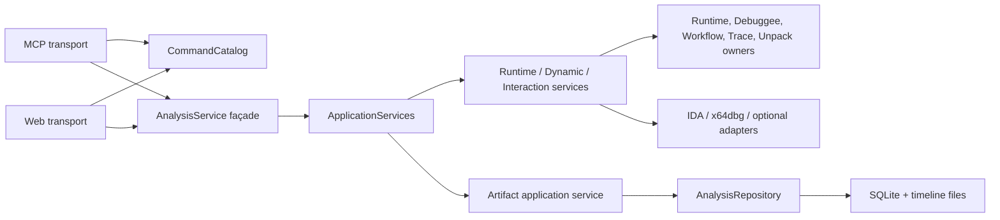
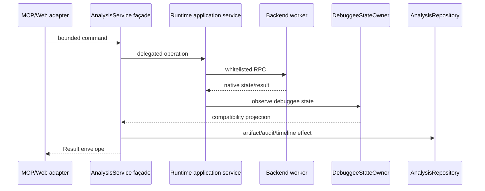

# Architecture

## Scope

`AnalysisService` remains the public compatibility façade. MCP, Web, CLI, and existing tests may continue calling the same methods and reading the documented compatibility fields. New orchestration logic belongs in explicit application services and state owners, not in the façade.

## Dependency direction

Dependencies point inward from transports to the application façade and ports. Backend clients and SQLite are adapters; domain state does not import either transport.

## State ownership

| State | Owner | Compatibility view |
| --- | --- | --- |
| Session lifecycle and attached handles | `SessionRegistry` | `AnalysisService.registry` |
| Backend worker/runtime identity | `BackendRuntimeOwner` | `_runtimes`, `_lock` |
| Debuggee run state and PID projection | `DebuggeeStateOwner` | session state/metadata |
| Terminal workflow snapshots | `WorkflowStateOwner` | `_terminal_workflows` |
| Unpack lifecycle/protection snapshots | `UnpackStateOwner` | `_unpack_sessions`, `_unpack_protect_snapshots` |
| Trace lifecycle/artifact status | `TraceStateOwner` | `_trace_sessions` |

Compatibility fields reference owner-managed dictionaries; they do not own state. New code must use the owner APIs so locking and lifecycle rules remain local.

## Persistence boundary

`AnalysisRepository` is the application persistence port. `SqliteAnalysisRepository` coordinates session, backend, audit, artifact, and timeline effects and exposes a unit-of-work boundary. `SessionStore` remains the SQLite implementation detail. Legacy `_store` access is retained only for compatibility during migration.

## Command and transport boundary

`CommandSpec`/`ToolSpec` contains command identity, service method, allowed transports, write/confirmation policy, and—after MCP binding—the exact typed handler, generated input schema, and description. MCP registration populates this shared catalog, while the loopback Web adapter consumes the same policy entries. Typed MCP wrappers remain the schema source, preserving all existing tool names and input contracts. Arbitrary debugger commands remain unavailable.

## Runtime data flow

## Migration rule

Do not add new responsibilities to `AnalysisService`. Add behavior to the matching application service or owner, expose a narrow façade delegate when compatibility requires it, and register transport metadata through `CommandCatalog`.